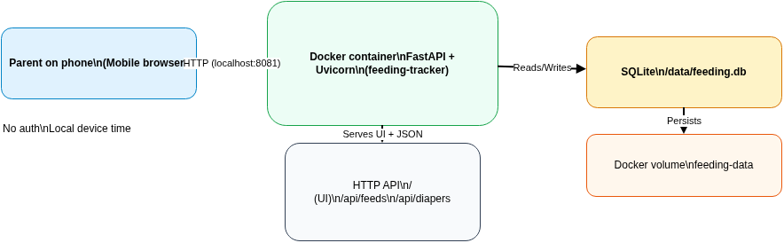

# Feeding Tracker

Local, mobile-first tracker for:
- Breastfeeding sessions (L/R, start/end)
- Diaper events (pee/poop, timestamp)



## Run (Docker)
```bash
docker compose up -d --build
```

Open: http://localhost:8081

## Features
### Feeding
- Log feeding sessions with breast side (**L/R**) + start + end time
- “Now” shortcuts
- Last 7 days summary split by L/R (count + total minutes)
- Recent feedings list + delete

### Diapers
- Tag diaper events as **pee** or **poop** with a single timestamp
- Last 7 days counts + recent list + delete

## Data
- SQLite stored in Docker volume `feeding-data` (mounted at `/data`)

## Diagram
- Source: `docs/diagrams/feeding-tracker-overview.drawio`
- Renders: `docs/diagrams/rendered/feeding-tracker-overview.(png|svg)`

## Notes
- No auth (intended for local use)
- Uses device local time
